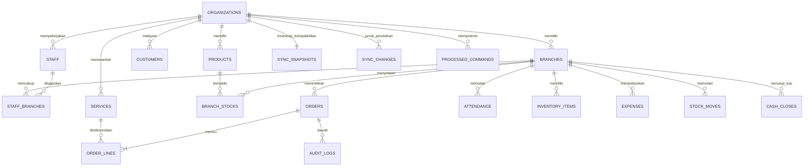

# Struktur RDBMS Cuciin

Pusat transaksi berada pada `orders` dan `order_lines`. Setiap order menyimpan cabang serta kasir pembuat; setiap baris menyimpan layanan, harga aktual nota, petugas yang menangani, dan tarif komisi pada saat transaksi. Karena tarif disalin ke baris transaksi, perubahan harga atau komisi katalog tidak mengubah laporan historis.

Stok memakai katalog `products` dan saldo gabungan `(branch_id, product_id)` pada `branch_stocks`. Layanan retail menunjuk `services.product_id`, sehingga penjualan tidak lagi bergantung pada kecocokan nama. Mesin dan aset lain berada pada `inventory_items` per cabang. `expenses`, `attendance`, `cash_closes`, `stock_moves`, dan `audit_logs` juga membawa cabang sehingga laporan dapat difilter dengan indeks.

`access_policies` menyimpan pembatasan modul/fungsi per pengguna dan hanya dapat diubah Owner. `whatsapp_templates` menyimpan pesan pembuka, pengantar, serta penutup bisnis untuk setiap pesan nota. File foto absensi tetap lokal di HP; database hanya menerima jam, cabang, dan catatan absensi.

`sync_snapshots` dipakai saat bootstrap instalasi lama atau perangkat baru. `processed_commands` menyimpan hash request dan hasil per `commandId`, sehingga retry sesudah timeout tidak menggandakan transaksi. `sync_changes` memberi sequence global monoton dan payload kanonis yang ditarik perangkat setelah revision terakhir. Saldo `branch_stocks` dijaga trigger non-negatif dan `stockMove` diterapkan sebagai delta di transaksi D1. Detail integrasi ada di [SYNC_API.md](SYNC_API.md).
